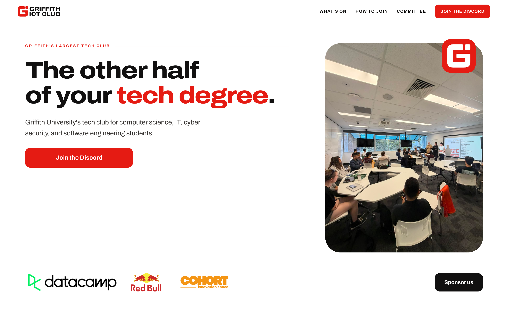

# Griffith ICT Club

The website and club tools for Griffith University's ICT Club. Events, membership, sponsors and committee information, alongside Discord bots for invites, booster perks and reimbursements.

[Visit griffithict.club](https://griffithict.club)

[](docs/media/homepage.png)

Built with Next.js, TypeScript and PostgreSQL in a pnpm workspace.

## Run locally

Requires Node.js 24+, pnpm and Docker. Fill in `.env` before running migrations.

```sh
pnpm install
cp .env.example .env
docker compose -f compose.dev.yaml up -d
pnpm db:migrate
pnpm dev
```

Open [localhost:3000](http://localhost:3000).

[Development](docs/development.md) · [Operations](docs/RUNBOOK.md) · [Handover](docs/handover.md)
